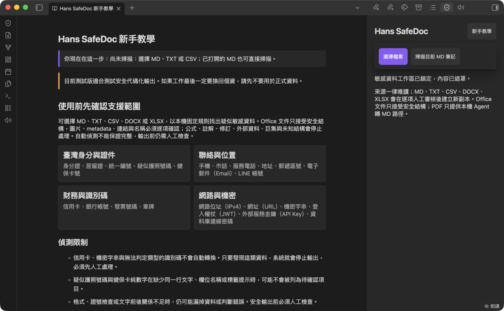
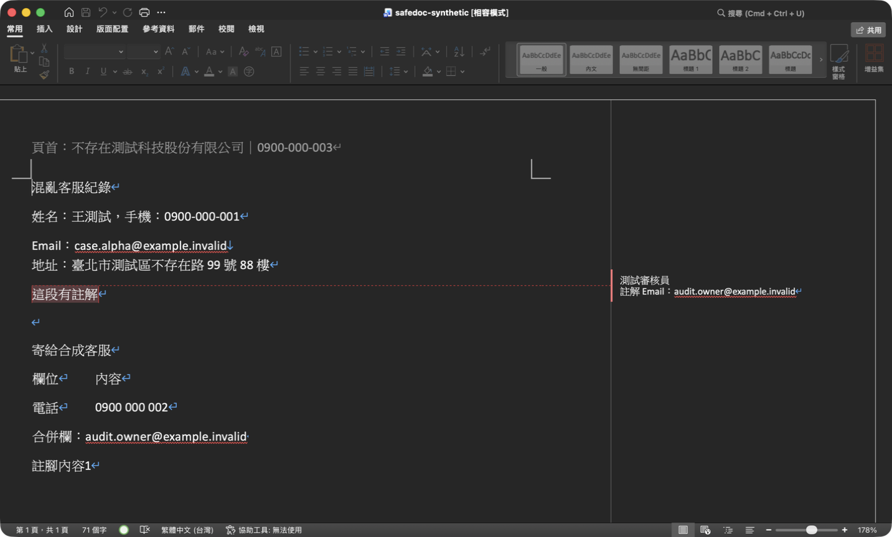
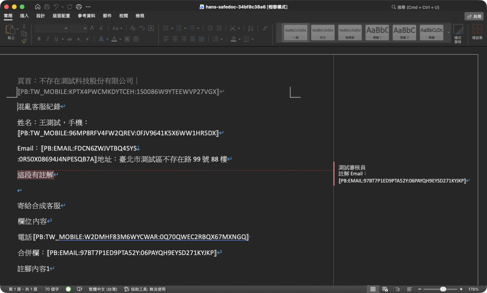
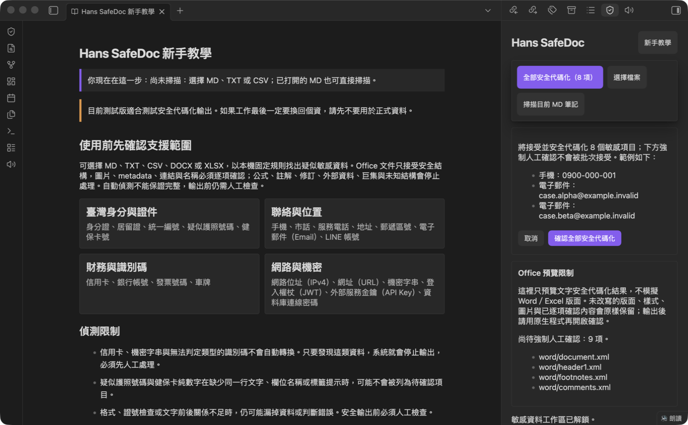

# Hans SafeDoc

[繁體中文](#安裝前先看)｜[English](#english)

Hans SafeDoc 是 Obsidian 電腦版的本機文件去識別化外掛。它只讀取來源，讓使用者逐項審核疑似敏感資料，再建立新的安全副本；原始文件不會被覆寫。

## 產品畫面

### 支援範圍與安全限制



### 轉換前後

| 純合成原始文件                                                                                           | Hans SafeDoc 安全副本                                                                                  |
| -------------------------------------------------------------------------------------------------------- | ------------------------------------------------------------------------------------------------------ |
|  |  |

### 人工確認



## 安裝前先看

> Hans SafeDoc 會盡量找出疑似敏感資料，但不能保證完整，也不構成法律上的匿名化認定。處理正式資料前請保留來源備份、逐項人工確認，並先用合成文件熟悉流程。

## 第一次使用

1. 選擇檔案，或打開一篇 MD 後掃描目前筆記。
2. 逐項決定接受或保留；批次接受也必須由使用者明確確認。
3. 檢查轉換預覽。來源若在審核期間改變，流程會失效並要求重來。
4. 設定本次 Job 的還原密碼。密碼不會儲存，遺失後無法找回。
5. 只有 adapter 重新開檔與殘留檢查通過後，才會在 Obsidian Vault 外建立安全副本；加密對照表另存於作業系統應用程式資料夾，不會進入 Vault 或安全輸出。

## 格式範圍

v1.3 支援下列唯讀來源：

- Markdown（`.md`）：嚴格 UTF-8，輸出新副本。
- 純文字（`.txt`）：嚴格 UTF-8；UTF-16、NUL 與不安全編碼會阻擋。
- CSV（`.csv`）：用確定性 parser 自動判斷逗號、Tab 或分號；只有結果模糊時才詢問。欄數不一致與試算表主動內容會阻擋。
- Word OOXML（`.docx`）：支援通過精確allowlist的文字、表格、頁首、頁尾、註腳與安全圖片結構。圖片不做OCR，metadata、超連結、主題與圖片必須逐項確認後原樣保留；修訂、巨集、OLE、外部內容及未知結構會阻擋。
- Excel OOXML（`.xlsx`）：支援通過精確allowlist的shared／inline文字、格式化識別碼、隱藏工作表與合併儲存格。工作表名稱、定義名稱、表格名稱、metadata與超連結必須逐項確認；公式、註解、外部資料、巨集、pivot及未知結構會阻擋。

PDF 不由外掛直接解析。必須先由本機 AI Agent 以確定性工具逐頁轉成 Markdown，確認沒有漏頁或掃描頁，再把該 MD 交給 Hans SafeDoc。原始 PDF 與未安全化 MD 優先留在 Vault 外。

舊版 `.doc`／`.xls`、RTF、ODT／ODS、圖片、音訊、影片、Obsidian 畫布（Canvas）、Obsidian 資料庫檢視（Bases）、壓縮檔與其他未列格式都會阻擋。Obsidian 手機版不支援。

人名、組織、專案、產品、部門、系統與自訂詞可匯入工作階段 JSON 客戶字典做精確比對；格式範例見 `examples/dictionary.simple.example.json`。字典不做模糊猜測、不寫入 Vault 或外掛設定，鎖定工作區或關閉外掛後會清除，且所有結果仍必須人工確認。自動偵測不保證完整，也不是法律上的匿名化判定。

## 正式版只使用固定規則

MD／TXT／CSV／DOCX／XLSX 的固定規則可獨立使用，不需要安裝 Ollama（離線模型執行工具）或 LLM（大型語言模型）。正式版不提供模型下載、離線模型匯入或模型推論：第三方候選未通過正式分發的授權／來源審查，零外部權重的自建候選也未達既定precision與recall門檻，因此全部排除於release資產及production runtime之外。

- release source與artifact不含model catalog、模型檔、downloader、model manager或ONNX runtime。
- 舊模型研究證據保留於原工作區，不進clean-room source或產品功能。
- 文件掃描、預覽、Job 對照與還原維持全程本機、零遙測；人名與組織可能漏判，輸出前必須人工檢查。

## 加密 Job 與安全還原

- 建立安全輸出前必須設定 12–256 個字元的密碼。密碼只用來透過 scrypt 衍生 AES-256-GCM 金鑰，不會被儲存。
- 安全代碼對照、原文顯示值與 token key 只存在 Vault 外的加密 Job Store；安全輸出與客戶字典都不包含 Mapping。
- 同一 Job 內，相同類型與正規化後相同的資料會得到相同安全代碼；不同 Job 會使用不同 key 與代碼，避免不必要的長期串聯。目前外掛每次輸出建立獨立 Job，因此不把 PII 代碼當成跨系統交易索引；需要跨 Log 關聯時，應優先在來源系統建立不含個資的穩定 correlation ID。
- 每份安全輸出會附帶不含 Mapping 的安全分析包（Safe Package）`.safe-package.zip` 與 `.analysis-request.json`；交給其他工具時必須兩份一起提供，並要求只回傳符合 `result-package.schema.json` 的 UTF-8 JSON。原生安全副本保留給本機版面檢查，不作為 Result JSON 的雜湊綁定來源。
- 「還原 AI 結果」只接受上述結構化 Result JSON。Job、安全分析包雜湊、匿名文件 ID、schema 或安全代碼任一不符，都會使整包還原停止。
- 還原結果永遠寫入新的 `Hans SafeDoc Restored/<Job>-results[-N]/`，不覆寫原始文件、安全輸出或 AI 回傳檔。還原副本再次包含個資，不應上傳雲端。

## 給 AI Agent：在本機操作 Hans SafeDoc

請複製首次教學或內建說明中的完整「本機操作」指令。指令會要求 Agent：原始文件不上雲、PDF 先在本機逐頁轉 MD、CSV 只用確定性 parser 判斷、遇人工審核立即停下、不得替使用者批次確認，且只有重新開檔與殘留檢查通過後才能回報安全副本。

## 給其他 AI：只處理安全分析包

請複製首次教學或內建說明中的完整指令，並只提供配對的 `.safe-package.zip` 與 `.analysis-request.json`。指令會限制 AI 不得讀取原始檔或還原個資、要求逐字保留每一個 `⟦PB:…⟧` 安全代碼，且只回傳符合 `result-package.schema.json` 的單一 UTF-8 JSON；完整性無法確認時必須停止。

## 安裝步驟

`hans-safedoc` 官方 listing 的「Add to Obsidian」啟用前，請使用下列手動安裝方式。

1. 從 GitHub Release 下載與 `manifest.version` 完全相同版本的 `main.js`、`manifest.json`、`styles.css`。
2. 將三個檔案放到 `<Obsidian Vault>/.obsidian/plugins/hans-safedoc/`。
3. 重新啟動 Obsidian，在第三方外掛頁面啟用「Hans SafeDoc」。
4. 先用內建合成練習筆記完成完整流程，再處理自己的文件。

## 開始閱讀

1. `docs/MASTER-SPEC.md`：唯一最高規格
2. `docs/DECISION-REGISTER.md`：已鎖定決策
3. `docs/IMPLEMENTATION-PLAN.md`：固定 Merge Order 與 Epic
4. `docs/ACCEPTANCE-MATRIX.md`：127 項驗收
5. `schemas/`：18 份 machine-readable data contracts
6. `docs/THREAT-MODEL-V1.1.md`：Hans SafeDoc 1.1 Phase 1 威脅模型
7. `docs/UX-STATE-MAP.md`：畫面、狀態與按鈕規則
8. `docs/TAIWAN-SYNTHETIC-BASELINE.md`：版本化臺灣繁中合成偵測基線
9. `docs/MIGRATION-AND-RECOVERY.md`：備份、復原、刪除與遷移
10. `docs/RELEASE-CHECKLIST-V1.1.md`：v1.1 Phase 1 Release Gates
11. `docs/ENGINEER-EXECUTION-PROTOCOL.md`：不中斷執行規則

## 規格優先順序

```text
MASTER-SPEC
→ JSON Schema
→ Acceptance Matrix
→ Golden Fixtures
→ Decision Register
→ Implementation Plan
→ GitHub Issue
→ Code comments
→ Existing code
```

## 現有程式碼

`reference/legacy-seed/` 只作為規則與測試起始素材，不是規格來源。回歸測試不得被用來宣稱企業資料準確率；它們只是最低安全基線。

## 開放產品決策

```text
0
```

發現未明確描述的實作細節時，依 `ENGINEER-EXECUTION-PROTOCOL.md` 的安全優先順序自行決定，不等待產品負責人。

## Release Stop

只有以下四類可以阻擋 Release，但其他工作繼續：

- STOP-01：可能毀損原始資料
- STOP-02：可能洩漏原始資料、Mapping 或金鑰
- STOP-03：無法安全遷移
- STOP-04：必要平台 API 不存在且無安全替代

## 套件驗證

`BUILD-REPORT.md` 列出：

- Schema 數量與驗證結果
- Acceptance Matrix 項目數
- Crypto test vector
- 規格檔案 Hash
- Legacy seed 是否成功納入

## English

Hans SafeDoc is a desktop-only Obsidian plugin for reviewing and pseudonymizing local documents without overwriting the originals. It supports read-only MD, TXT, CSV, DOCX, and XLSX sources and creates a new safe copy only after item-by-item review and artifact verification.

### Installation

1. After the Obsidian directory review is approved, open **Settings → Community plugins → Browse** and search for **Hans SafeDoc**.
2. Select **Install**, then **Enable**.
3. If directory installation is not yet available, download `main.js`, `manifest.json`, and `styles.css` from the GitHub Release matching `manifest.version`, then place them in `<Vault>/.obsidian/plugins/hans-safedoc/` and restart Obsidian.

### Basic usage

1. Open a Markdown note or choose a supported local file.
2. Review every suspected sensitive value and every mandatory Office surface.
3. Inspect the preview, then create a safe copy.
4. Set and retain the per-Job restore passphrase, then open the output in its native application and verify it before sharing.
5. To restore an AI-returned result, require one UTF-8 JSON object matching `result-package.schema.json`, then choose the original Job and passphrase; Hans SafeDoc validates the Safe Package hash, document IDs, schema, and every token before writing a new Result Vault.

### Privacy and limitations

- Document processing is local and includes no telemetry or network requests.
- The plugin reads only the selected source and writes a new safe copy outside the vault; it never overwrites the source.
- Token mappings are encrypted outside the vault with a passphrase-derived key. The passphrase is never stored and cannot be recovered by the plugin.
- A session-only exact-match customer dictionary can cover names, organizations, and internal terms without installing a model.
- Detection can miss names, organizations, and context-specific identifiers. Manual review is always required and does not constitute a legal determination of anonymization.
- DOCX and XLSX use a narrow fail-closed profile. Macros, formulas, external content, tracked changes, and unknown OOXML structures are blocked.
- PDF, legacy `.doc` and `.xls`, mobile Obsidian, and unsupported formats are not processed directly.
